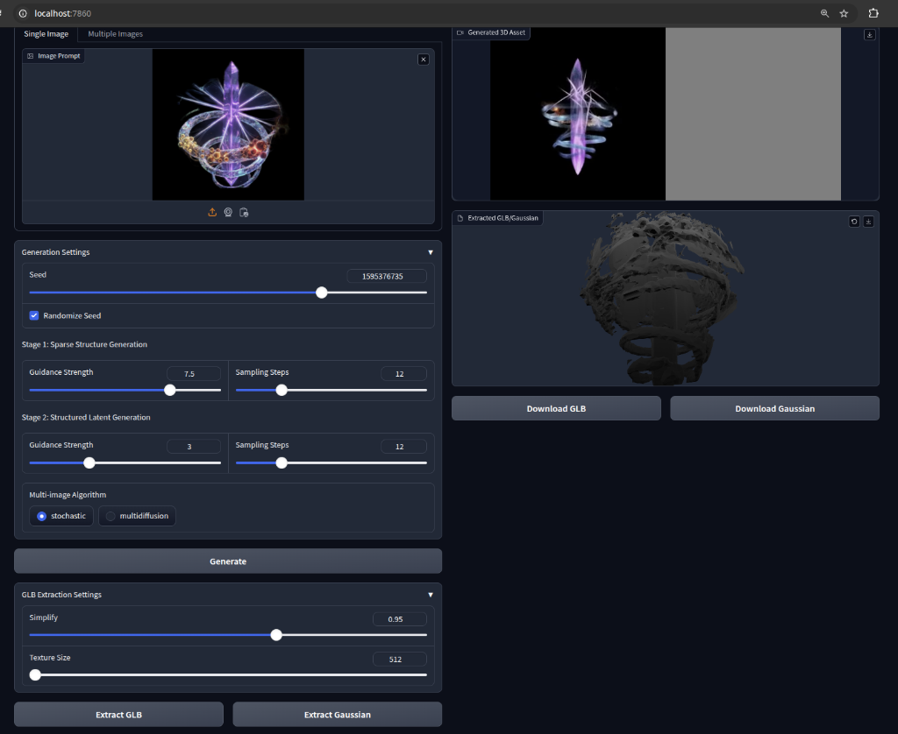

# TRELLIS-AMD

**TRELLIS running on AMD GPUs with ROCm** - Image to 3D Asset Generation

This is a fork of [Microsoft TRELLIS](https://github.com/microsoft/TRELLIS) modified to run on AMD consumer GPUs (tested on RX 7800 XT with ROCm 6.4.2).



## Features

| Feature | Status |
|---------|--------|
| ✅ Gaussian Splatting | Working (145+ it/s) |
| ✅ Gaussian Export (.ply) | Working |
| ✅ Mesh Extraction | Working |
| ✅ GLB Export with Textures | Working |

## Requirements

- AMD GPU (tested: RX 7800 XT, RDNA3)
- ROCm 6.4+ 
- Python 3.10+
- ~16GB VRAM recommended

## Quick Start

```bash
# Clone the repository
git clone https://github.com/YOUR_USERNAME/TRELLIS-AMD
cd TRELLIS-AMD

# Run the installation script
chmod +x install_amd.sh
./install_amd.sh

# Activate environment and run
source .venv/bin/activate
ATTN_BACKEND=sdpa XFORMERS_DISABLED=1 SPARSE_BACKEND=torchsparse python app.py
```

Then open http://localhost:7860 in your browser.

## What's Different from Original TRELLIS?

### nvdiffrast-hip Modifications
- Added `CoarseRasterSimple.inl` - AMD-safe coarse rasterizer avoiding warp-level sync
- Added HIP warp intrinsic compatibility macros
- Modified kernel entry points to use simplified implementation

### diff-gaussian-rasterization Modifications
- Fixed `DuplicateWithKeys` kernel buffer initialization
- Fixed C++ ABI compatibility for ROCm PyTorch

### TRELLIS Application Modifications
- Switched to OpenGL rasterization backend
- Disabled `fill_holes` in mesh postprocessing (avoids broken visibility check)

## Known Limitations

1. **Mesh Preview**: The mesh preview may show grey. The actual mesh extraction and GLB export work correctly.
2. **fill_holes Disabled**: Small holes in meshes may not be filled.
3. **Performance**: Simplified coarse rasterizer is slower than NVIDIA-optimized version.

## Troubleshooting

### GPU Hang/Crash
Ensure you're using ROCm 6.4+ and PyTorch built for ROCm.

### Empty Mesh
Check that `fill_holes=False` is set in `trellis/utils/postprocessing_utils.py`.

### CUDA Symbol Errors  
Make sure you're using the AMD-modified extensions in this repo, not the original CUDA ones.

## Credits

- Original [TRELLIS](https://github.com/microsoft/TRELLIS) by Microsoft
- [nvdiffrast](https://github.com/NVlabs/nvdiffrast) by NVIDIA
- AMD GPU modifications developed through extensive debugging of HIP compatibility issues

## License

See original licenses for TRELLIS, nvdiffrast, and diff-gaussian-rasterization.
